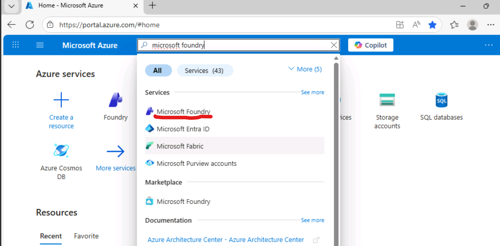
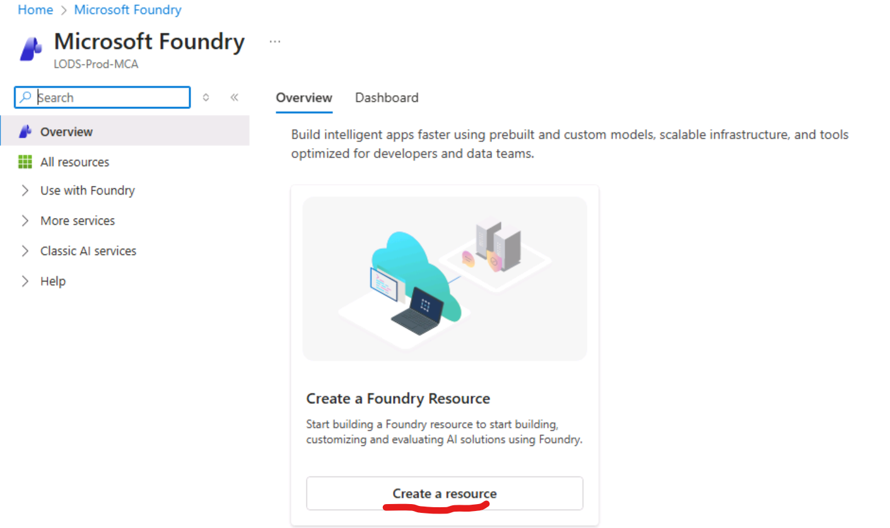
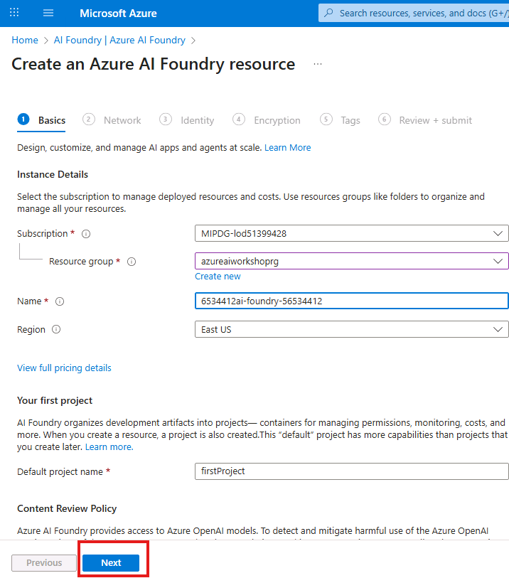
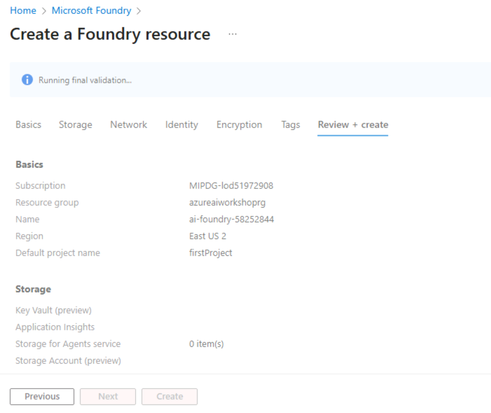
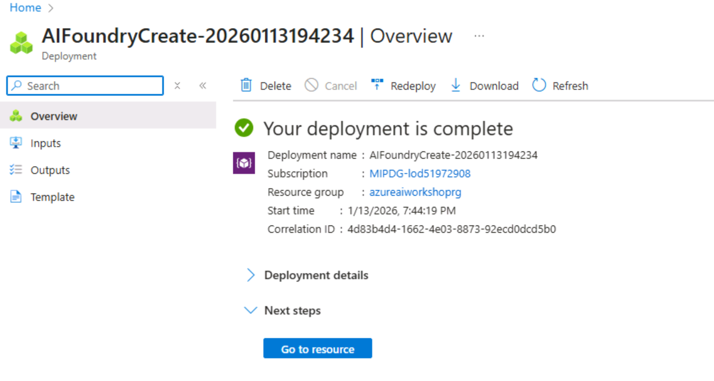

# Create Microsoft Foundry Project

## Introduction 

This lab walks you through the steps to create a **Microsoft Foundry** resource using the **Azure Portal**. This is a required setup step before proceeding with lab exercises involving AI Foundry capabilities.

### 💡 What is Microsoft Foundry
Azure AI Foundry is a unified platform for building, deploying, and managing enterprise-grade AI applications and agents—combining powerful tools, models, and infrastructure with built-in governance and scalability.

## Objectives 
In this lab we will:
- Create Microsoft Foundry Resource and project	

## Estimated Time 

2- 10 minutes 

## Scenario
You are creating Azure AI Foundry project that will be utilized later in the labs for several modules in this workshop.

## Pre-requisites
No pre-requisites

## 🛠️ Tasks

### 1. Sign in to Azure Portal

Go to [https://portal.azure.com](https://portal.azure.com) and sign in with your Azure credentials. These credentials are present on the right hand side under resources tab below **Azure Portal**.

### 2. Search for "Azure AI Foundry"

- In the top search bar, type **"Microsoft Foundry"**
- Select **Microsoft Foundry** from the search results

### 3. Create "Microsoft Foundry"

- Under Overview, click **"Create a Foundry Resource"**

### 4. Fill in the details and deploy

- Choose the Subscription if not filled in automatically
- Use the precreated resource group that is provided as part of this lab machine instance - **azureaiworkshoprg**
 
- Give a name for the Azure AI Foundry resource. Please use this name as the lab environment will not let you use another name - +++**ai-foundry-@lab.LabInstance.Id**+++ (eg ai-foundry-53439517).The screen shot provided here is just for reference, do not use the name provided in the screenshot below
- Choose a Region (eg East US 2)

- Use this Default project name - firstProject. The lab environment will not let you use another name (firstProject).

- Click **Next** button. Use this as a reference image for details but choose the existing resource group and fill in the rest of the details

- For this lab, Keep defaults for subsequents tabs (Network, Identity, Encryption, Tags) and Click **Next** button until **Review + submit**
- Click **Create** button
- In less than 2 minutes your deployment should complete

### 5. Verify Deployment, and Go to Microsoft Foundry portal

- Click **Go to resource**

  
- Review the **Overview** details for the Azure AI Foundry resource you just created.
- Click **Go to Foundry Portal**

