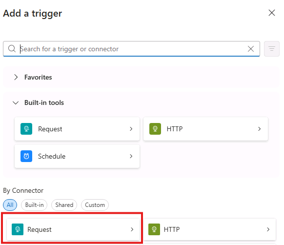
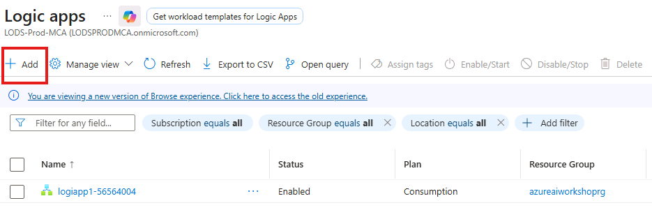

# AI Language Service with Agents Lab

## Introduction 

In this lab you will interact with the Azure AI language cognitive service API using the Logic App low code workflow designer. 
You will create 2 low code Logic Apps
(1) for PII removal
(2) for Language detection and translation

For advanced/bonus content you will use these Logic Apps to create AI agents that work together to prepare data. 


## Objectives 
 List the objectives
In this lab we will:
-	Learn how to call the Azure AI langugage cognitive service API for different tasks 
- Process data via the API as part of a business workflow


## Estimated Time 

60 minutes 

## Scenario
You work for Contoso, a multinational e-commerce company that receives thousands of customer feedback messages daily in various languages. These messages often contain sensitive personal identifying information (PII) and your company wants to ensure all messages have the language detected, PII removed to ensure privacy compliance, translation to English for centralized analytics. 

## Pre-requisites

Note: This Low Code lab requires access to:
-	the AI Language Service in Azure AI Foundry
-	Access to provision Logic Apps and resources in Azure
-	Azure OpenAI (bonus/advanced only for Agent creation)


## Tasks
**Note:** This Low Code lab requires access to:
- The AI Language Service in Azure AI Foundry
- Access to provision Logic Apps and resources in Azure
- Azure OpenAI (bonus/advanced only for Agent creation)


## Overview

In this lab, you will interact with the Azure AI language cognitive service API using the Logic App low code workflow designer.  
You will create **2 low code Logic Apps**:
1. **PII removal**
2. **Language detection and translation**

For advanced/bonus content, you can use these Logic Apps to create AI agents.


## Create an Azure AI Foundry Project (if you did not create one in the pre-requisites lab) and Access Language API Key

1. Login to Azure AI Foundry: https://ai.azure.com/. 
2. Click **+Create new** and then Azure AI Foundry resource. Give a name for the Azure AI Foundry resource. Please use this name as the lab environment will not let you use another name - +++**ai-foundry-@lab.LabInstance.Id**+++ (eg ai-foundry-53439517).
   _Note: See “Prequisite - AI Foundry Resource Creation” folder to ensure Foundry Hub is correctly set up._
   If it has been set up and the project is created, please skip to - **Create a PII Redaction Logic App** step in this lab.
   
   

4. Name your project (e.g., `<<Name>>-AI-Lang-Project`). 


4. Once the project is created and opens, on the Overview page, note the Azure AI Services endpoint and API Key.


5. Store these values:  
   - **APIKey**
   - **Target (Endpoint)**
6. You will use these details to connect to the Language Service.

---

## Create a PII Redaction Logic App

This Logic App receives text input and outputs the text with PII redacted. It creates an endpoint callable from other applications.

1. In https://portal.azure.com/, navigate to **+ Create a resource** and search for _Logic App_, then click **Add**. 
2. Under plan, choose **Multi-tenant** under Consumption, then click **Select**.
3. Select the same Resource Group as your AI Foundry project and follow the prompts to create a Logic App resource. For name for the Azure Logic App resource. Please use this name as the lab environment will not let you use another name - +++**logiapp1-@lab.LabInstance.Id**+++ (eg logiapp1-53439517).. 
4. Once provisioned, select **Go to Resource** in the Azure Portal to open the new Logic App.
5. Expand Development tools and open **Logic App Designer**. Select **Add a trigger**.

 
 


6. Search triggers for “When a HTTP request is received” and select it.
7. Under Request Body JSON Schema, add:
   
 ```json
    {
      "type": "object",
      "properties": {
        "HTTP_URI": {
          "description": "URI for HTTP Request",
          "type": "string"
        },
        "HTTP_request_content": {
          "description": "Content or Body of the HTTP Request",
          "type": "string"
        }
      }
    }
  ```
    
8. In the description field, add:  
   _When a request is received, review the message for PII data and redact it with ******._
   
9. Click the plus sign to add an action, then **select Add an action**. 


10. Search for _Parse JSON_ and select the option under Data operations. 


11. Under Content, select the Dynamic content lightning bolt, and under When a HTTP request is received, select Body.


12. Under the Schema box, paste in:

    ```json
    {
      "type": "object",
      "properties": {
        "description": {
          "type": "string"
        }
      }
    }
    ```
    


13. The final screen should look like the screenshot below:

  

14. Select **Save** on the canvas.
15. Click the plus sign to add an action, then **select Add an action**.


16. Search for _Azure Language_ and then click **See more**.


17. Select **Detect Personal Information (V3.1)**.


18. Select Authentication Type as **Api Key** and add the API Key and Endpoint (Target) you saved earlier.


19. Select the Detect Personal Information action. 
Under Parameters, search for the Documents heading. Select **+ Add new item**.  


Insert:
- Id-1 = 1
- Text-1 = Insert expression (fx)


20. In the pop-up expression window, paste:  
    ```
    body('Parse_JSON')['description']
    ```

    Click Add

21. Click the plus sign to add the final action, then **select Add an action**.


22. Search for _Response_ and select the option under Request.


23. Fill in the parameters for the Response, leaving Status Code as 200.
24. In the Body, select the expression using the fx icon and paste:
    ```
    body('Detect_Personal_Information_(V3.1)')['documents'][0]['redactedText']
    ```
    Click Add


25. Save your Logic App.

26. Select the arrow next to Run, then **Run with payload**.


27. In the Body of the Run with payload pane, paste:
    ```json
    {
      "description": "My phone number is (04) 12 345 678"
    }
    ```

28. Confirm that the output displays the redacted phone number.


29. The final completed flow should look like the image below:


---

## Create a Translation Logic App

This Logic App receives text, detects the language, and outputs the text in English.

1. In https://portal.azure.com/, search for _Logic Apps_ and select the option.




2. Click **+ Add** to add a new Logic App and choose Multi-tenant under Consumption, then click **Select**.
3. Ensure you are selecting the same region and resource group as your Foundry project. Name your Logic App `EnglishTranslation`.
4. Review and create the Logic App, then select **Go to resource** once provisioned.
5. Under development tools, select **Logic app designer** and then **Add a trigger**.


6. Search triggers for “When a HTTP request is received” and select it.
7. Under Request Body JSON Schema, add:

```json
{
    "type": "object",
    "properties": {
      "HTTP_URI": {
        "description": "URI for HTTP Request",
        "type": "string"
      },
      "HTTP_request_content": {
        "description": "Content or Body of the HTTP Request",
        "type": "string"
      }
    }
}
```

8. In the description field, add:  
   _Receives an HTTP request in the description field of some text. Then translates that text to English._


9. Select **Save**.
10. Click the plus sign to add an action, then **select Add an action**.


11. Search for _Parse JSON_ and select the option under Data operations.


12. Under Content, select the Dynamic content lightning bolt, and under When a HTTP request is received, select Body.


13. Under the Schema box, paste in:

```json
{
    "type": "object",
    "properties": {
        "description": {
          "type": "string"
        }
    }
}
```

14. The final screen should look like the screenshot below:


15. Select **Save** on the canvas.
        
16. Click the plus sign to add an action, then **select Add an action**.


17. Search for _Azure Language_ and then click **See more**.(This step is to understand what is available). Once reviewed, go back to main search and follow the steps below.
18. Search for _Microsoft Translator V3_ and then click **See more**.
19. Select **Translate Text**. Create the connection using the same API Key and Resource name (not the full Endpoint) from Foundry.


Note that the Translator Resource Name must be the part highlighted in the screenshot below:


20. Under Parameters, set:
    - **Source Language:** Auto-detect
    - **Target Language:** English
    - **Body Text-1:** Choose expression (fx)  


In the expression field, paste:  

```
body('Parse_JSON')['description']
```

Then click **Add**


21. Click **Save**.
22. Click the plus sign to add the final action, then **select Add an action**.


23. Search for _Response_ and select the option under Request.


24. Fill in the parameters for the Response, leaving Status Code as 200.
25. In the Body, select the expression using the fx icon and paste:

    ```
    body('Translate_text')[0]['TranslatedText']
    ```


26. Save your Logic App.
27. Select the arrow next to Run, then **Run with payload**.


28. In the Body of the Run with payload pane, paste:
```json
    {
       "description" : "Mi número de teléfono es (04) 12 345 678"
    }
    {
       "HTTP_request_content" : "Mi número de teléfono es (04) 12 345 678"
    }
```

29. Confirm the output displays the translated text.


30. The final completed flow should look like the image below:


---

## Advanced / Bonus Content

You work for Contoso, a multinational e-commerce company that receives thousands of customer feedback messages daily in various languages. These messages often contain sensitive PII. Your company wants to ensure all messages have the language detected, PII removed, and are translated to English for centralized analytics.

You will create **2 agents** using Azure AI Foundry:
1. **Translation Agent**
2. **PII Redaction Agent**

---

### Update your Logic App flows to accept the format from AI Foundry

1. In the Azure Portal (https://portal.azure.com/) first open your EnglishTranslation flow, in edit mode click on the **Translate Text** box and click the cross next to the dynamic input, _Body Description_ to remove it.


2. Put the cursor after the "Text": and then click on the _fx_ function option that appears. In the Dynamic Content box select Http_request_content then click Add. Click outside of the flow and press save. Ensure you have saved the changes to the flow. 


3. Repeat this step for your PII Redaction flow , in edit mode click on the **Detect Personal Information (V3.1)** box and click the cross next to the dynamic input, _Body Description_ to remove it.


4. Put the cursor after the "Text": and then click on the _fx_ function option that appears. In the Dynamic Content box select Http_request_content then click Add. Click outside of the flow and press save. Ensure you have saved the changes to the flow. 


---

### Deploy an Azure OpenAI Resource for Your Project

1. In your Azure AI Foundry (https://ai.azure.com/) project, click on **Agents**.


2. If the Deploy a Model doesn’t pop up, select **Deploy model**.
3. Ensure you select a model that supports agents in your region:  
   https://learn.microsoft.com/en-us/azure/ai-services/agents/concepts/model-region-support
4. Search for **gpt-4.1** and select **Confirm**.

5. The Agent screen should open with your first agent automatically created.


---

### Create a Translation Agent

1. Select the Agent checkbox and rename the Agent to **EnglishTranslationAgent**.

2. In the Instructions, paste:
    > Send all incoming messages that are not in English to the EnglishTranslation action. If the entry is already in English, return the original text unchanged. Ensure the output maintains the structure and formatting of the input data.
3. In the Description, paste:
    > This agent uses the AI Language Services to translate incoming information to English for downstream analytics.
4. Next to Actions, select **+ Add**.

5. In the pop-up modal window, select **Azure Logic Apps Your Actions**.


6. Your Logic Apps from part one should appear. Select **English Translation**.  
   _Note: If your Logic App does not appear, ensure it is in the same subscription and resource group as Foundry, the Logic App HTTP request description is in place, and the workflow contains a Request Trigger and ends with a Response Action._

7. On the Resource screen, click **Next**, then on the Schema screen, click **Create**.
8. On the Agent Setup screen, select **Try in playground**.
9. Try a sentence in English, then in Spanish:  
   - `Hello, how are you today?`  
   - `Hola ¿cómo estás hoy?`


10. Click on View Run Info to show that the translation ran with the Logic App action to support the translation:


11. **NOTE:** If you see a gateway error you may need to try again as services complete deployment 

---

### Add a PII Redaction Agent

1. Update the agent instructions to :
    - **Instructions:**  
      > Send all messages to the PIIRedaction action to have personal information removed. 
Then send all incoming messages with the personal information remoed that are not in English to the EnglishTranslation action. If the entry is already in English, return the original text unchanged. Ensure the output maintains the structure and formatting of the input data.

2. Next to Actions, click **+ Add** then **Azure Logic Apps**.
3. Select Azure Logic Apps and choose your PIIRedaction flow
4. On the basic information screen, add:
    - **Action Description:**  
      > For any text provided, replace any sensitive or personal identifying information (PII) with *********
5. On the setup screen, select **Try in playground** and paste in:
    ```
    Hola, me llamo Mateo Gómez. Perdí mi tarjeta de crédito el 17 de agosto y quisiera solicitar su cancelación. Mi última compra fue un plato de pollo a la parmesana en el Restaurante Contoso, cerca del Museo de Hollywood, por $40. A continuación, se detallan mis datos personales para su validación: Profesión: Contador. Número de Seguro Social: 123-45-6788. Fecha de nacimiento: 9-9-1989. Número de teléfono: 949-555-0110. Dirección personal: 1234 Hollywood Boulevard, Los Ángeles, CA. Correo electrónico vinculado: mateo@contosorestaurant.com. Código Swift: CHASUS33XXX.
    ```

6. The output should look similar to the below:  
 

7. Click on View Run Info to show that the translation ran with both the Logic App actions to support the translation: 
 


