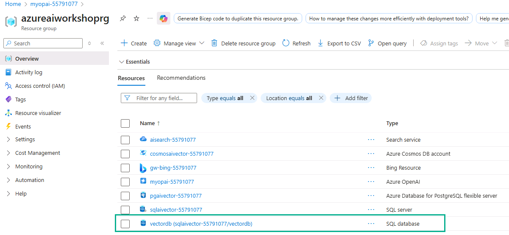
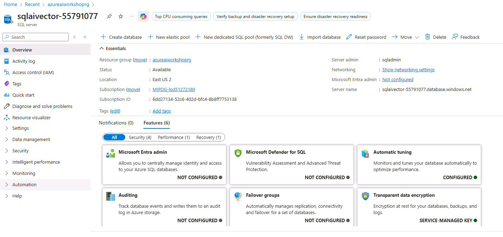
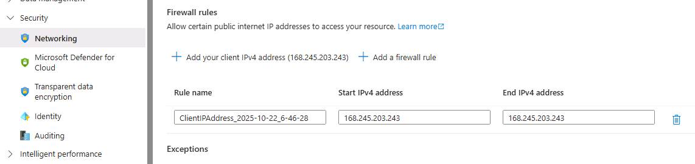
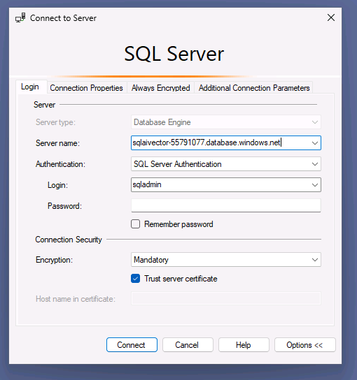
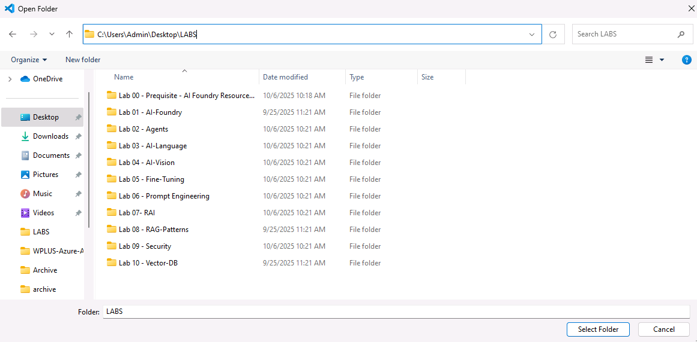
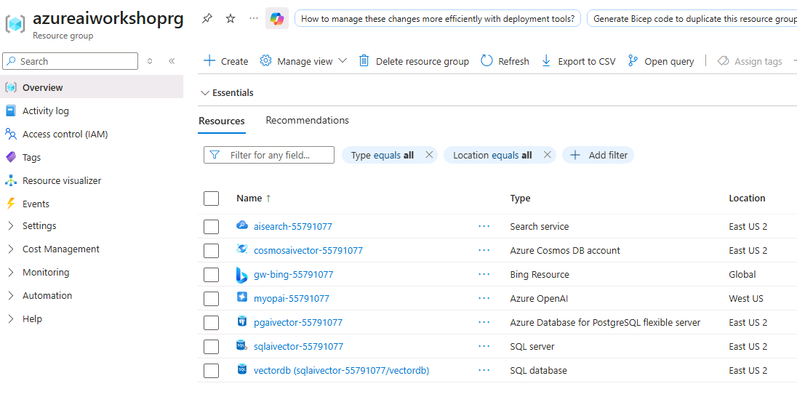
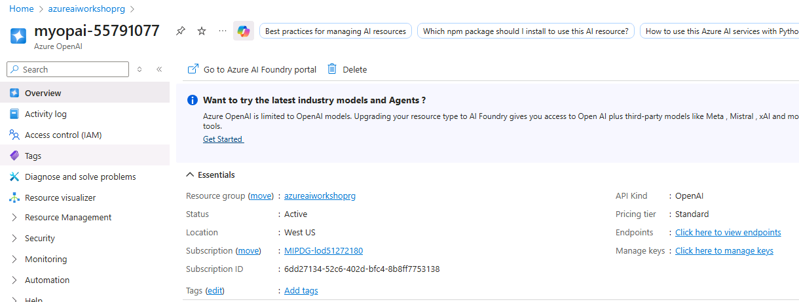
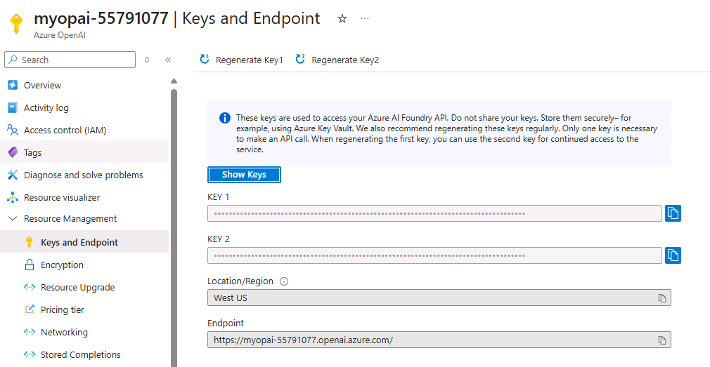

## Introduction
This lab shows you how to use Azure SQL Database as a backend for storing and searching vector data in AI scenarios.
 
## Objectives
Store and retrieve vector data.
Perform similarity searches using PostgreSQL.
 
## Estimated Time
20 minutes
 
## Scenario
You need a relational database solution (SQL DB) that also supports storing and querying AI vector data. This lab guides you through the process, step by step.
 
## Pre-requisites
None. The database has been pre-created for you.
 
## Tasks
Execute files in [SQL folder](https://github.com/Azure/WPLUS-Azure-AI-Platform-and-Services/tree/AugRelease/Vector-DB/Cosmos%20DB) in ascending order. Files are numberd 1_.... , 2_.... etc. The .sql files need to be executed in SQL Server Management Studio, which is preloaded on Desktop for you, while .py files are executed with "python file.py" - for example "python 2_LoadMovideData.py" (the previous assumes you have nagivated to the directory containing the Python file).


# Lab: Using Vector Databases in Azure SQL Database

## 1. Locate Your Azure SQL Database
1. In the **Azure Portal**, navigate to your resource group (in this example: `azureaiworkshoprg`).
2. Locate your SQL Database resource (example: `vectordb`).
3. Click on the database name to open its details.



---

## 2. Get the Server Name
1. In the SQL Database overview page, note the **Server name** value (example: `sqlavector-53809613.database.windows.net`).
2. You will need this server name to connect from SQL Server Management Studio (SSMS).



---

## 3. Open SQL Server Management Studio (SSMS)
1. Launch SSMS from your taskbar or Start menu.
2. Ensure SSMS is installed before proceeding.


---

## 4. Connect to the Server in SSMS
1. In the left-most navigation blade on the SQL Server page, navigate to Security/Networking.
2. In the 'Firewall rules' section, select 'Add your client IPv4 address'. Select Save. 





3. In the **Connect to Server** dialog:
   - **Server type:** Database Engine  
   - **Server name:** Paste the value from Step 2.  
   - **Authentication:** SQL Server Authentication  
   - **Login:** Your SQL admin login (example: `sqladmin`)  
   - **Password:** Your admin password  
4. Click **Connect**.



---

## 5. Select the Database
1. Click the **Options >>** button in the connection window.
2. In the **Connect to database** field, type your database name (example: `vectordb`).
3. Click **Connect**.


---

## 6. Open the Setup Script
1. In SSMS, go to **File → Open → File...**.
2. This allows you to load the SQL file for setting up the lab environment.


---

## 7. Select the SQL Setup Script
1. Navigate to the folder containing your lab files.
2. Select the setup script (example: `1_Setup.sql`).
3. Click **Open**.


---

## 8. Run the Setup Script
1. Review the SQL script to confirm it matches the intended schema.
2. The example script:
   ```sql
   drop table if exists dbo.MovieQuotes;
   go

   create table dbo.MovieQuotes
   (
       id int identity(1,1),
       quote nvarchar(max),
       movie nvarchar(max),
       year_released char(4),
       embedding vector(1536),
       constraint pk_quotes primary key clustered (id)
   );
   go
   ```
3. Press **F5** or click **Execute**.
4. Verify the **Commands completed successfully** message.


---

## 9. Open Visual Studio Code
1. Launch **Visual Studio Code** from your taskbar or Start menu.


---

## 10. Open the Lab Folder in VS Code
1. In VS Code, go to **File → Open Folder...**.
2. Select the folder containing the lab files on the Desktop..
3. Click **Select Folder**.


---

## 11. Select the Lab Folder
1. In the **Open Folder** dialog, navigate to your lab directory.
2. Select the `SQL` folder containing your lab files.
3. Click **Select Folder**.



---

## 12. Trust the Folder in VS Code
1. When prompted, choose **Yes, I trust the authors**.
2. This enables all features for working with your files.


---

## 13. Locate the Azure OpenAI Resource
1. In the Azure Portal, open your resource group (example: `azureaiworkshoprg`).
2. Find and select your Azure OpenAI resource (example: `myopai-resource-53809613`).



---

## 14. View Azure OpenAI Resource Overview
1. Review the resource overview to confirm:
   - **Status** is Active
   - **Location** matches your deployment needs
   - Subscription and API information is correct



---

## 15. Get Keys and Endpoint
1. In the **Keys and Endpoint** section:
   - Copy your **KEY 1** value (keep it secure)
   - Copy the **Endpoint** value
2. You will use these in your `.env` file for the lab scripts.



---

## 16. Update the `.env` File
1. Open `.env` in VS Code. (This file should have been renamed from .env.example - so remove the .example part if you have not already.)
2. Populate the variables:
   - `AZURE_OPENAI_EMBEDDING_ENDPOINT` with your Azure OpenAI endpoint
   - `EMBEDDING_MODEL_DEPLOYMENT_NAME` for your embedding model.  This should be "text-embedding-ada-002" and was created in the PostgreSQL lab.  Review the steps in the PostgreSQL lab to deploy this model if you have not already.
   - `AZURE_OPENAI_EMBEDDING_API_KEY` from Step 15
   - `SQL_SERVER` - full URL of your Azure SQL Server

---

## 17. Open a New Terminal in VS Code
1. In VS Code, go to **Run → Terminal → New Terminal**.
2. This will open a terminal in the project’s folder.


---

## 18. Load Data into SQL Database
1. In the terminal, run the data load script:
   ```powershell
   python.exe .\2_LoadMovieData.py
   ```
2. This script reads from the CSV and inserts data into your SQL table.


---

## 19. Verify Data in SSMS
1. In SSMS, run:
   ```sql
   SELECT * FROM dbo.MovieQuotes;
   ```
2. You should see rows populated with `NULL` in the `embedding` column (these will be filled later).


---

## 20. Access Azure OpenAI Foundry Portal
1. From your Azure OpenAI resource page, click **Explore Azure AI Foundry portal**.
2. This portal allows you to deploy and test AI models, including embeddings.


---

## 21. Update Movie Embeddings
1. In VS Code terminal, run the update script:
   ```powershell
   python.exe .\3_UpdateMovieEmbedding.py
   ```
2. This script generates vector embeddings for each movie quote using your Azure OpenAI deployment.


---

## 22. Confirm Embedding Update Completion
1. The terminal should display:
   ```
   Embeddings updated for all quotes.
   ```
2. This means the `embedding` column in your SQL table now contains vectors for each row.


---

## 23. Generate SQL Embeddings
1. In the terminal, run:
   ```powershell
   python.exe .\4_SQLEmbeddings.py
   ```
2. This script may be used to test embeddings or store additional ones for querying.


---

## 24. Open the Vector Search Query Script
1. In SSMS, go to **File → Open → File…**.
2. Select `5_query.sql` from your lab folder.


---

## 25. Run a Vector Similarity Query
1. Example `5_query.sql`:
   ```sql
   declare @x nvarchar(max) = 'texas city'
   declare @retval int, @embedding vector(1536)
   exec @retval = dbo.get_embedding @x, @embedding output;

   select top(10) *,
       vector_distance('cosine', @embedding, embedding) as dist
   from MovieQuotes
   order by dist asc;
   ```
2. This retrieves the top 10 most similar quotes to the given search phrase.


---

## 26. View the Embedding Model in Azure AI Foundry
1. In the **Azure AI Foundry** portal, go to **Model catalog**.
2. Locate and select the embedding model you are using (example: `text-embedding-ada-002`).


---

## 27. Deploy the Embedding Model
1. Click **Use this model** and configure the deployment:
   - **Deployment name:** matches your `.env` value
   - **Deployment type:** Global Standard
   - Ensure your AI resource, location, and capacity meet requirements.
2. Click **Deploy** to make it available for your scripts.


